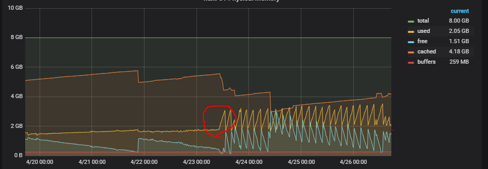
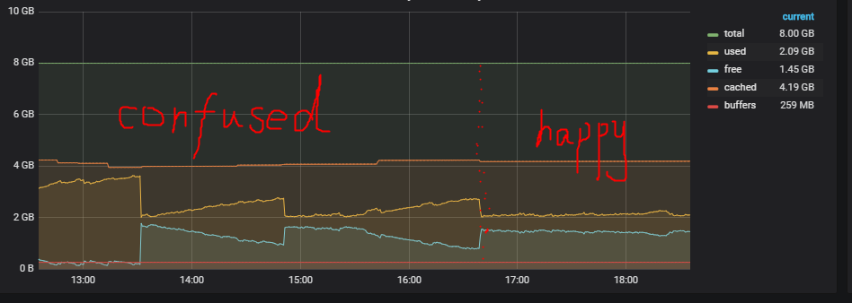

### 问题出现：

4.24早上一来，老入就让我看zelda-nuxt的使用内存，我一看就惊了

圈红的左侧是以往的内存使用情况，有轻微的内存泄漏，曲线以一个非常缓慢的速度增长。但是红圈附近，从4.23上午十点左右开始，内存使用率激增。由于使用了pm2进程守护，内存到一定值的时候，整个node服务器会重启，这才能把不断攀升的内存给降下来。后来就陷入了涨内存-》到阈值-》重启-》涨内存-》到阈值-》重启的循环，形成了一个尖锐的锯齿图。

这个图有个特点就是非常的规律，也没有随不同时间不同访问量的变化而变化。

整个人是懵圈的，数十个页面，上百个组件，稳定运行了那么久，怎么突然就内存大量溢出了呢？
### 问题筛查：

1. 是否是前端上线代码造成的？

    不是。前端4.23及以后没有上线过新代码，也没有node_modules的包更新。

2. 是否是后端上线代码造成的？

    不是。后端上的东西没有影响。

### 尝试方案：

首先让老入搭了一个线上测试环境（用线上代码和线上数据库但是不对外开放）并每5s访问一次首页，成功复现了这个问题，并且开始监控这台服务器的性能。然后开始各种尝试（三人并发解决，有方向了就一起调试）：

- 使用process.memoryUsage不停打印使用的内存。

    失败。由于打印出来的都是点，很难看出趋势，也没太明白那些值代表的意义。

- 使用heapdump打印node内存快照

    失败。由于项目比较大，每打印一次既要消耗服务器cpu又要占用大量文件内存，而且打印出来的东西太多太杂，很难看懂。甚至可能因为快照太大，chrome调试器崩溃了。我们也很崩溃。

- 使用easy-monitor查看运行服务器的node内存，并分析泄漏点。

    失败。同heapdump。因为esay-monitor的原理也和heapdump类似，所以项目过大导致它收集、分析处理非常慢，经常都崩溃，可以说一次都没正常打印过。不过靠这个在只有框架（去掉了页面和组件）的情况下，找到了一个小的泄露点。

- 试图在自己的电脑上搭建实时查看自己起的前端测试服务器内存。

    失败。我尝试过和线上一样的搭配，但是因为环境问题，比较难实现。然后又用highstocks加上node把内存情况写入json，大致监听了process.memoryUsage的情况。还没用太久，小v就已经定位到泄漏点了。

- 一步一步屏蔽代码，缩小问题范围。

    成功。小v靠着查看任务管理器的内存情况，先去掉其他页面，只保留首页，然后一步步屏蔽测试定位到泄漏点。这种调试方式非常缓慢，因为需要不停访问页面来让服务器泄漏，这需要一定的时间。但是这种方式生效了。要是我，可能坚持不了这么调试，实在是复杂又费时。所以在此给小v点个赞~

### 最终原因：

在首页的一个视频组件里，created函数写了一个setInterval。当视频为直播时，开始执行定时器。问题在于执行之后却没有相应的清除操作。由于服务器端渲染是会执行created钩子函数的，所以在有直播的时候，服务器端每次被访问都会生成一个无法被终止的定时器。是一个非常经典的内存泄漏（因为考虑到整个项目已经稳定运行很久了，我还信誓旦旦地和淳哥说我们没有可能这么用，脸好疼）。

问题的突然爆发就是因为4.23日上午十点左右新增了首页的直播视频。之所以原来没有发现内存泄漏，要么就是有直播的时候我们还没有开始监控内存使用情况，要么就是一直没碰到直播视频。

### 复盘：

如果当时多想那么一点，或者多做那么一点，也许会早点发现。那哪些操作可能会提前找到问题呢？

1. 突然出现的bug，除了和最近上线的代码有关，也可能和突然出现的数据有关。所以应该在公司里询问当天上线（已问）或者开展、推广的活动，在更大的范围内寻求帮助。一定是那天有什么东西变化导致了性能的突变。 虽然当时询问过后端有无上线的东西，但是没有获得什么线索。其实应该扩大范围，不局限于最近修改代码的方向上，在全公司问一下，如果当时有人提到当天上午十点增加了直播视频，那我们应该能尽早定位到问题。

2. 问题本应可以分解。已知首页会复现问题的情况下，应该缩小问题范围，把其他与首页无关的东西都注释掉，然后再查更具体的问题。其实也有动态规划的思想在里面，把全项目范围的bug降级为首页的bug，再降级到更小的层次。

3. 了解process.memoryUsage里的参数。最开始测试的时候只关注了heapUsed，没有关注rrs。这次内存泄漏没有导致heapUsed的增长，而我刚开始测试的时候只关注了heapUsed。要是能再了解一点，结合泄漏图十分说不定可以快点想起来

4. zelda-nuxt的配置项让我有些迷茫，经常都浪费了大把的时间在测试配置项上，至今我也没有启动起线下前端build环境+线上后端的配置。应该再深入了解一下这些配置项都是怎么揉到项目里的。

最后再放一张正常运行的内存图，开心地下班回家过只有一天的周末了~

